# Entendiendo a nuestros clientes: Informe de Análisis de Ventas
**Proyecto:** PF_FashionDataInsights

## 1. ¿Qué hicimos y por qué?
El objetivo de este análisis fue sumergirnos en el historial de compras de la tienda para entender realmente **quiénes son nuestros clientes y cómo se comportan**. En lugar de adivinar qué ropa sugerirles, analizamos una muestra representativa de miles de transacciones para que los datos nos cuenten la historia.

Esta información es el cimiento para construir un sistema de recomendaciones que sea verdaderamente inteligente y personalizado.

---

## 2. Descubrimientos Generales: ¿Cómo compran?

### 2.1 Distribución de Edad de los Clientes

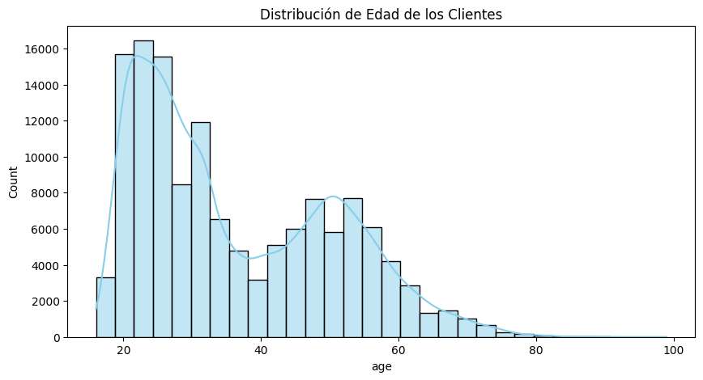

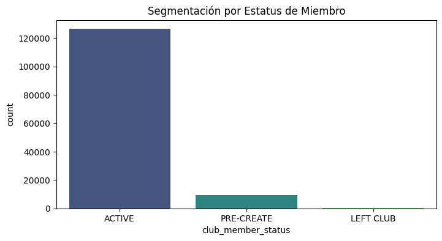

* **El reinado de la tienda online:** Descubrimos que la inmensa mayoría de las compras se realizan por la tienda web (Canal 2) frente a las tiendas físicas. Lo más sorprendente es que **esto aplica para todas las edades**. El mito de que "la gente mayor solo compra en el local" no se cumple en nuestra tienda.
* **El bolsillo es igual para todos:** Al analizar cuánto gastan los clientes, vimos que la edad no importa. Tanto los más jóvenes (Gen Z) como los mayores (Seniors) gastan en promedio la misma cantidad de dinero por prenda.
* **Nuestro público principal:** El motor principal de las ventas, es decir, el grupo de clientes más numeroso y activo, está compuesto por los Millennials y la Generación Z.

---

### 2.2 Top 10 Categorías de Productos y Colores más Vendidos

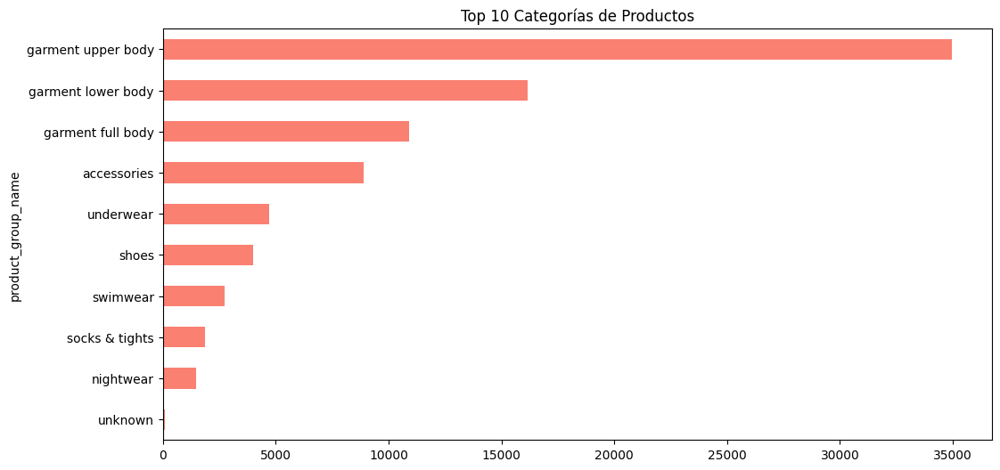

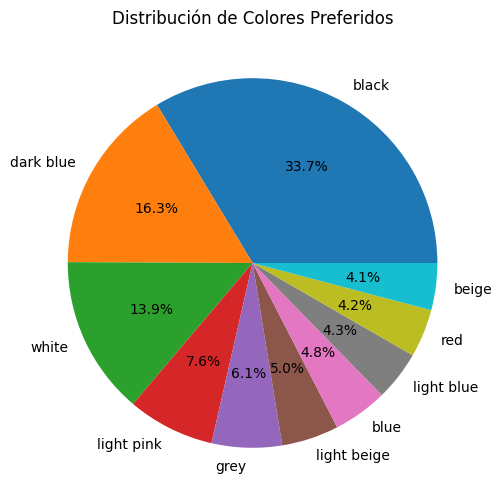

* Las **prendas superiores** (*Garment Upper Body*) dominan el volumen de ventas con una diferencia significativa sobre el resto de categorías, seguidas por las prendas inferiores y las de cuerpo completo.
* Existe una brecha pronunciada entre las primeras 3 categorías y el resto, lo que indica una concentración de ventas en pocas categorías clave.
* Esto representa una oportunidad directa para el sistema de recomendación: hay categorías enteras del catálogo siendo subexplotadas que podrían crecer con recomendaciones cruzadas inteligentes.

---

## 3. Análisis Multivariado: Edad, Precio y Canal de Venta

### 3.1 Gasto Promedio por Generación

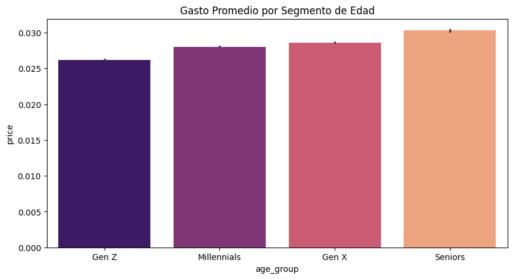

### 3.2 Mapa de Correlación

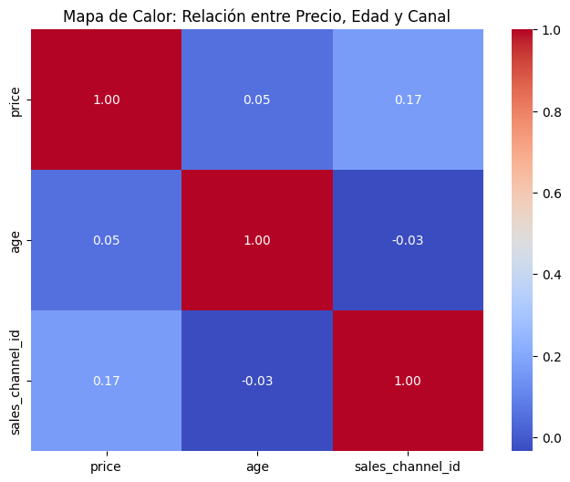

### 3.3 Pairplot Multivariado

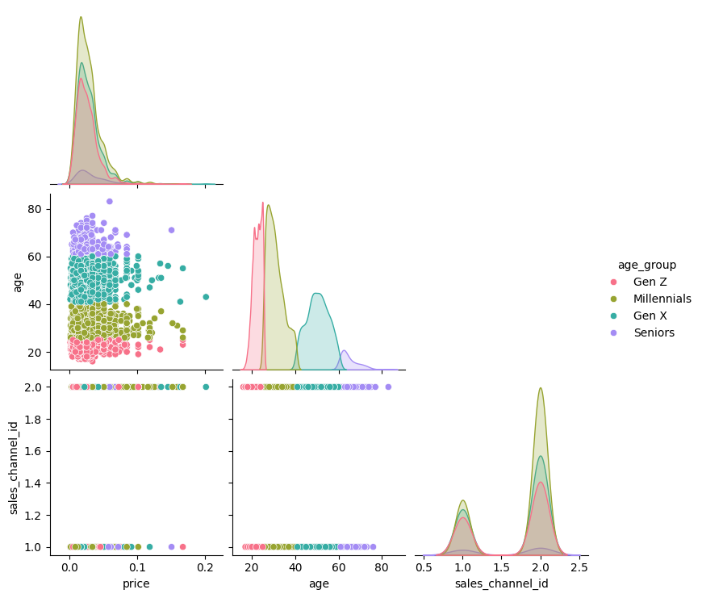

A partir del análisis de correlación cruzada sobre una muestra representativa de 5.000 transacciones, extraemos los siguientes insights clave:

* **El comportamiento de precios es universal:** La distribución de precios muestra que todas las curvas generacionales se superponen casi perfectamente. **La edad no define el gasto por prenda** — todos los grupos concentran sus compras en el mismo rango de precios bajos/medios, consistente con el modelo de negocio *fast fashion* de H&M.
* **Dominio absoluto del canal online:** La preferencia por lo digital atraviesa a **todas las generaciones**, derribando el mito de que los Seniors solo compran en tiendas físicas.
* **Ausencia de correlación lineal Edad-Precio:** No se observa ninguna tendencia clara entre edad y precio pagado. Sin embargo, los pocos *outliers* de precios altos muestran una ligera mayor concentración en Millennials y Gen X.
* **Base demográfica joven:** El volumen duro de clientes está fuertemente traccionado por Millennials y Gen Z, siendo los picos más altos de densidad en el dataset.

---

## 4. Evolución Temporal de las Ventas

### 4.1 Ventas Diarias (2018–2020)

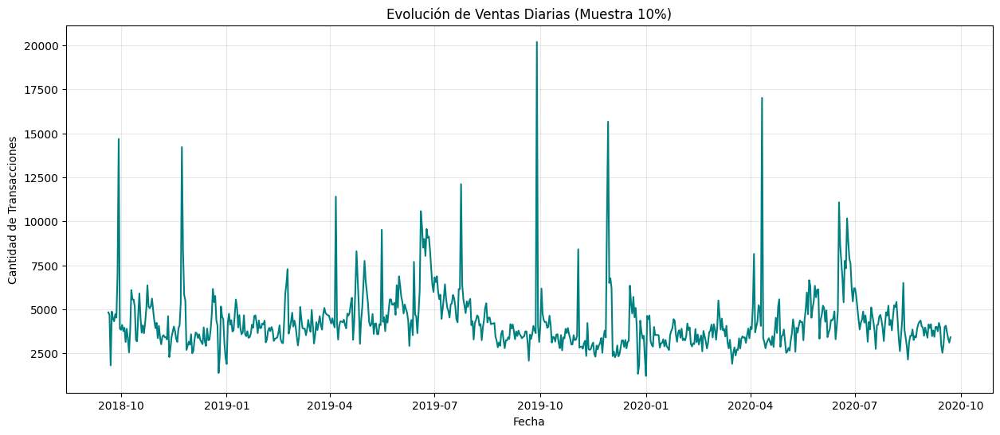

Los picos pronunciados no son anomalías — son oportunidades. Cada uno corresponde a un evento comercial específico y predecible:

* **28-09-2019** (20,188 transacciones): **Pico Histórico — H&M Member Days**. Representa el punto de máximo engagement de los usuarios en la plataforma.
* **11-04-2020** (17,012 transacciones): **Sábado de Pre-Pascua**. Incremento impulsado por compras festivas y regalos.
* **29-11-2019** (15,659 transacciones): **Black Friday 2019**. Gran volumen generado por la campaña de descuentos masivos globales.
* **29-09-2018** (14,680 transacciones): **H&M Member Days 2018**. Coincide con el lanzamiento estratégico de la temporada Otoño/Invierno.
* **23-11-2018** (14,216 transacciones): **Black Friday 2018**. Fecha clave que marca la consolidación de ventas de fin de año.

> **Implicación para el modelo:** el sistema de recomendación no puede ser estático. Un cliente que compra en Black Friday tiene un comportamiento diferente al que compra un martes cualquiera. El modelo debe capturar esta temporalidad.

---

## 5. Análisis de Productos: ¿Qué se vende y cuándo?

### 5.1 Precio Promedio por Temporada

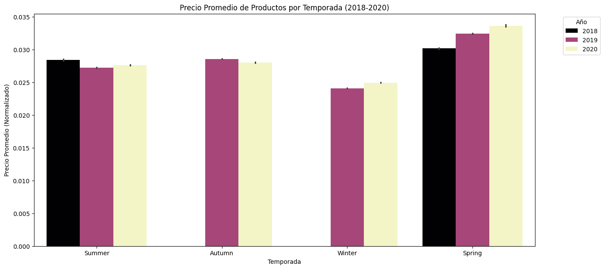

* **Política de Precios Estable:** H&M mantiene un ticket promedio relativamente constante a lo largo del año, reforzando su posicionamiento de *fast fashion* accesible.
* **Efecto Lanzamiento vs. Liquidación:** Se observa un pico en el ticket promedio durante **Spring** (Septiembre–Noviembre), coincidiendo con la entrada de colecciones pesadas (abrigos). En contraste, **Winter** (Junio–Agosto) presenta los precios promedio más bajos, reflejando el fuerte impacto de las rebajas y liquidaciones estacionales.

### 5.2 Tendencias Estacionales por Producto

Los artículos más vendidos por temporada revelan tres patrones clave:

**1. Los Reyes del Denim (Atemporales)**
* **`jade hw skinny denim trs`**: Líder indiscutible. Aparece en el primer puesto en Summer 2019, Spring 2019, Summer 2020 y Spring 2020. Es el producto con mayor resiliencia comercial del dataset.
* **`luna skinny rw`**: El escolta constante. Se mantuvo en el top 2 durante prácticamente todo 2018 y 2019.

**2. El Ascenso del "Confort" (Tendencia 2020)**
* **`timeless midrise brief`**: No figuraba en los primeros puestos en 2018, pero en Autumn/Winter 2020 se convirtió en el producto #1 en ventas.
* **`tilly (1)`**: Escaló posiciones rápidamente en el último año, desplazando a artículos de denim tradicionales.

**3. Dinámica Estacional Específica**
* **`ozzy denim shorts`**: Aparece con fuerza en Winter 2019 (Junio–Agosto), indicando nichos de volumen que persisten fuera de temporada.
* **`simple as that triangle top`**: Domina Autumn/Winter 2019, sugiriendo campañas de stock fuertes en ropa interior y swimwear.

> **Implicación para el modelo:** un modelo que no capture la evolución temporal recomendará productos en declive. El sistema debe aprender que las tendencias cambian año a año.

---

## 6. Segmentación por Edad: Cada Generación Compra Diferente

Los artículos más vendidos por segmento de edad revelan patrones que justifican técnicamente el enfoque personalizado:

* **El salto generacional del Denim:** `jade hw skinny denim trs` es el rey de la **Gen Z** (6,428 transacciones) y muy fuerte en **Millennials** (5,312), pero **desaparece completamente del Top 5 en Seniors**.
* **Transición hacia la formalidad:** A medida que avanza la edad, ingresan al Top 5 artículos como `pluto rw slacks` y `primo slacks`. Los cortes formales reemplazan a las prendas juveniles.
* **Nichos exclusivos por edad:** El segmento **Seniors** tiene un favorito exclusivo: `skinny ankle r.w brooklyn` (613 transacciones), que no aparece en el ranking de ninguna otra generación.
* **Los comodines transversales:** `luna skinny rw` y `tilly (1)` tienen atractivo universal — se mantienen en el top de todos los segmentos.

---

## 7. Análisis por Género y Color

### 7.1 Ventas Totales por Grupo de Género

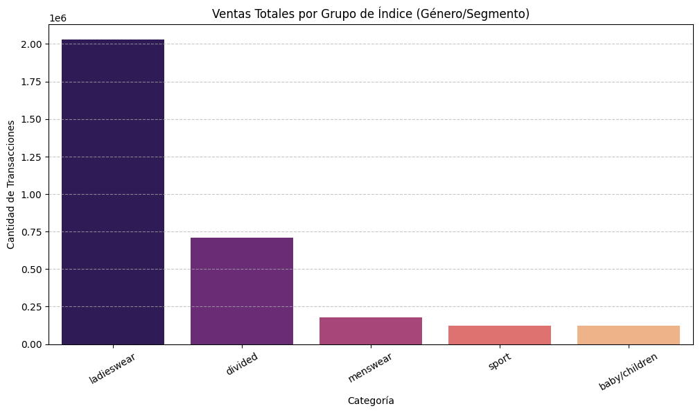

### 7.2 Preferencia de Color por Género

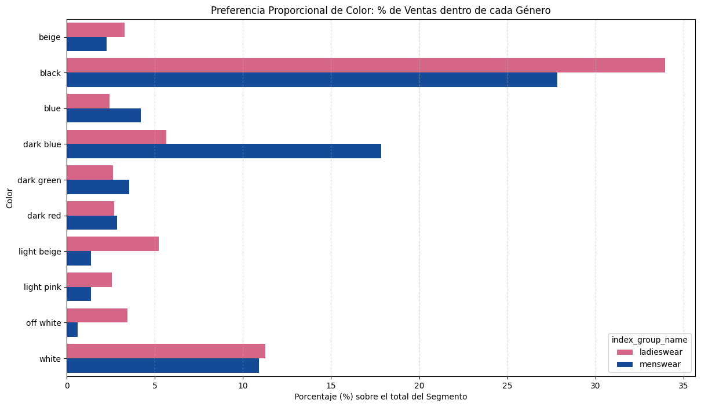

El análisis del top 10 de colores revela diferencias significativas entre *Ladieswear* y *Menswear*:

* **El reinado del Negro:** Es el color más elegido por ambos géneros, pero con mayor peso en el armario femenino (más del 33% de sus compras) frente al masculino (cerca del 28%).
* **El Azul Oscuro es el "segundo básico" masculino:** Para los hombres es el segundo color más importante (~18% de sus compras), mientras que en mujeres apenas supera el 5%.
* **Los tonos claros dominan en mujeres:** *Light Beige*, *Off White*, *Beige* y *Light Pink* tienen presencia mucho mayor en *Ladieswear*. En *Menswear* son marginales (1–2%).
* **El Blanco como punto de encuentro:** Es el único color (fuera del negro) que mantiene proporción casi idéntica en ambos segmentos, rondando el 11%.

### 7.3 Preferencia de Color por Generación

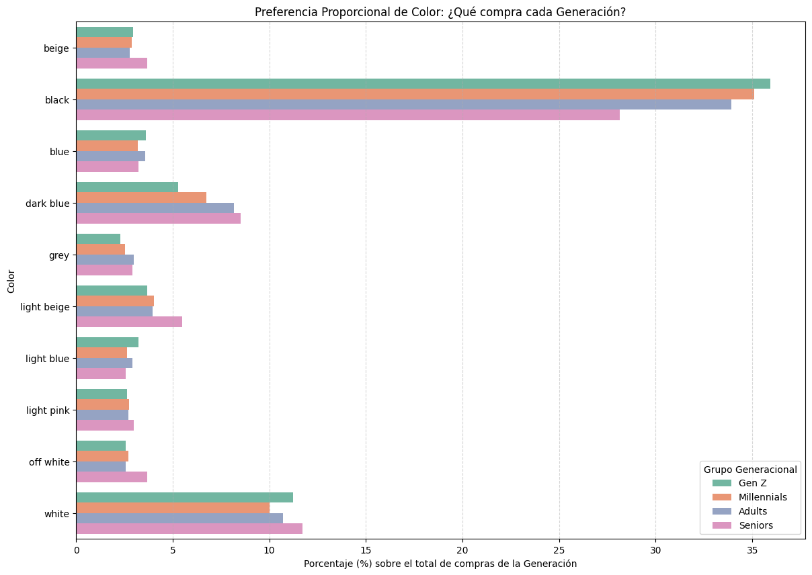

El cruce entre preferencias de color y grupos etarios revela patrones contraintuitivos de alto valor para la segmentación:

* **La "oscuridad" es joven:** El color **Black** alcanza su pico máximo en la **Gen Z** (más del 35% de sus compras) y disminuye de forma escalonada con la edad, tocando su mínimo en **Seniors** (~28%).
* **El Azul Oscuro madura con el cliente:** Exactamente inverso al negro — los **Seniors** lo eligen en mayor proporción (~8–9%) frente a la **Gen Z** (5%). Mismo patrón en *Light Beige*, *Off White* y *Beige*.
* **El Blanco en forma de "U":** Muy fuerte en **Seniors** (~12%) y repunta en **Gen Z** (~11%), con una leve caída en Millennials.
* **Los colores universales:** *Grey*, *Light Blue*, *Light Pink* y *Blue* son verdaderamente intergeneracionales, manteniéndose estables entre 2.5% y 4% sin importar la edad.

---

## 8. ¿Para qué nos sirve esta información?

Estos descubrimientos son una mina de oro para el algoritmo de recomendación:

| Hallazgo | Impacto en el modelo |
|---|---|
| Patrones de compra distintos por generación | Segmentar recomendaciones por grupo etario |
| El denim domina en jóvenes, desaparece en Seniors | Evitar recomendaciones genéticas entre segmentos |
| Tendencias temporales (denim → confort en 2020) | Capturar evolución temporal en el modelo |
| Picos de venta predecibles (Black Friday, Member Days) | Calibrar recomendaciones según el momento del año |
| Preferencias de color distintas por género y edad | Enriquecer features con atributos de artículo |

Si usáramos un sistema básico, le recomendaríamos ropa rosa o beige a un hombre adulto simplemente porque "se vende mucho" en el total de la tienda. Gracias a este análisis, nuestro sistema será lo suficientemente inteligente para entender que a ese hombre le conviene recibir recomendaciones de ropa azul oscura, mientras que a una chica de 20 años le ofrecerá las últimas tendencias en prendas negras.
